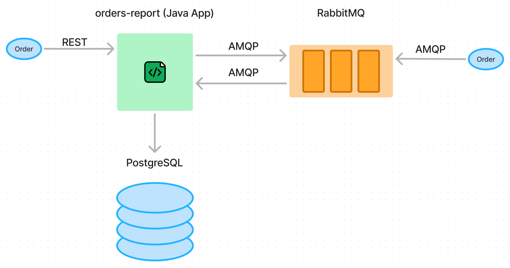
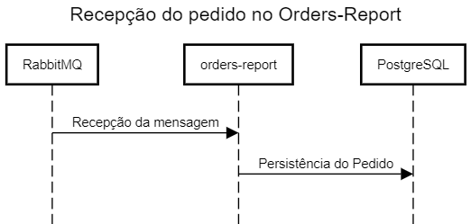
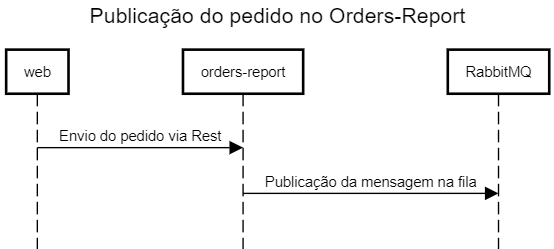
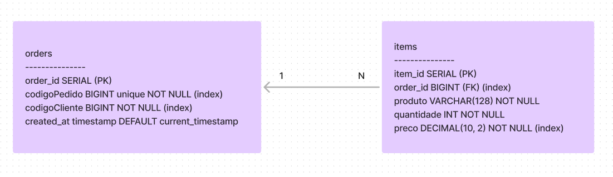
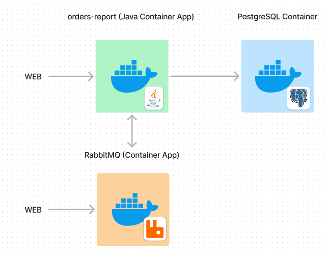
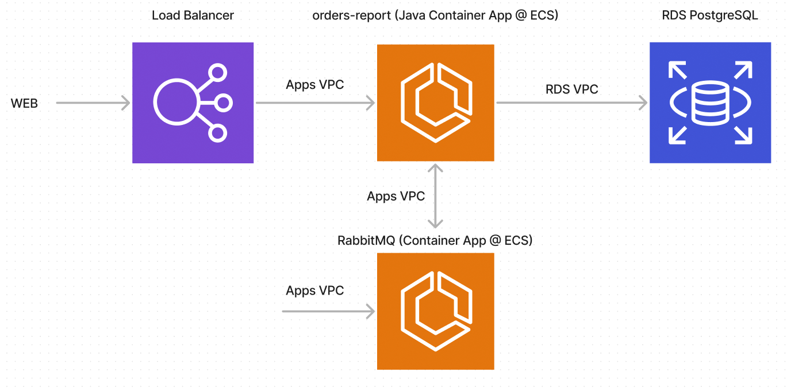
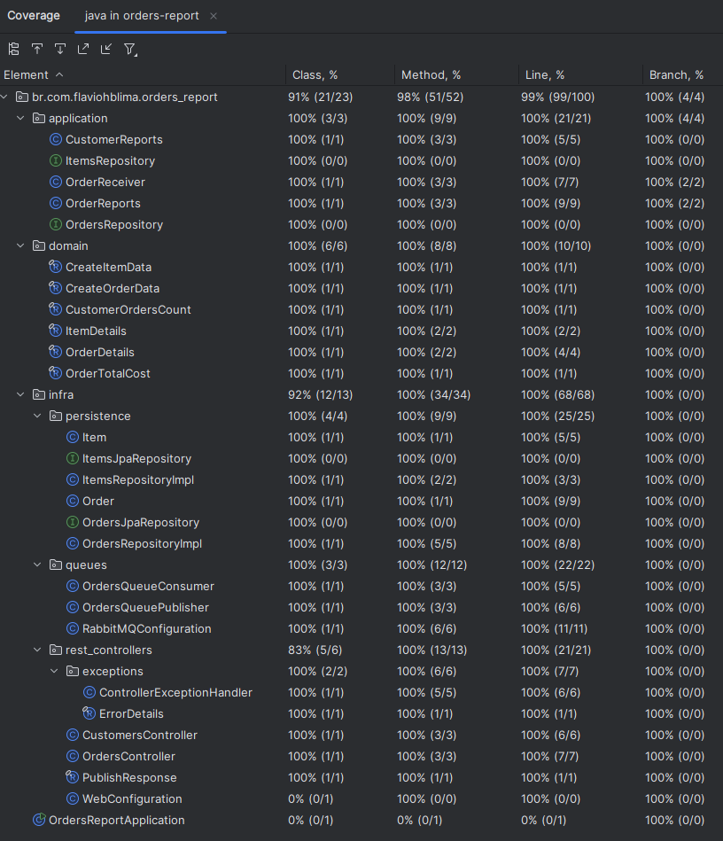

# Relatório Técnico

## Plano de trabalho (previsto vs realizado)

No arquivo de plano inicial vs realizado eu coloquei o tempo estimado e o tempo dedicado em cada uma das atividades.
Não consegui realizar duas das atividades a tempo da data de entrega: fazer deploy da aplicação na AWS e testes no
ambiente AWS.

Acredito que isso ocorreu principalmente pelo tempo que dediquei nos testes unitários e de integração, onde eu
dediquei aproximadamente 5h nos testes unitários e outras 5h nos testes de integração. O motivo do tempo maior foi
a falta de familiaridade com algumas configurações de testes do RabbitMQ test container.

## Tecnologias utilizadas

Escolhi usar o último java LTS, o java 21. Escolhi também usar a IDE que tenho mais familiriadade, o Intellij na versão
Community.

Para o RabbitMQ optei pela imagem de versão 3.13-management, que, além de ser a última versão estável, oferecia a
interface web para interação caso fosse necessário.

Optei por usar o PostgreSQL pela facilidade de criar relacionamento entre entidades no banco de dados e pela segurança
em manter um modelo estável de dados.

## Diagrama de arquitetura

Decidi criar um endpoint auxiliar na aplicação para envio de pedidos. Isso facilitou os testes manuais.
Abaixo está o diagrama da Arquitetura da solução.



O diagrama abaixo representa o fluxo normal de recepção de pedidos, via RabbitMQ.



O diagrama abaixo representa o envio de pedidos via rest api para facilitar o uso da API.



## Modelagem da base de dados

O diagrama abaixo representa o relacionamento entre pedidos e itens. Cada pedido pode ter N itens. Os itens se
relacionam com os pedidos através da foreign key do order_id.
Decidi por criar um id para os itens e para os pedidos. Além de garantir integridade do banco de dados, isso pode ajudar
em eventuais migrações de dados.



## Diagrama de implantação da solução

Abaixo está o diagrama de "implantação" da solução, onde cada recurso se encontra em um container docker separado.
O arquivo docker compose foi criado pensando nessa estrutura.



## Diagrama de infra com os recursos cloud utilizados

Não consegui realizar o deploy na AWS a tempo. Mas minha intenção era registrar as imagens necessárias no ECR, subir as
imagens do app e do RabbitMQ no ECS, além de usar o RDS gratuito do PostgreSQL. Disponibilizaria um LoadBalancer aberto
para a web para integração externa.



## Evidência de Testes funcionais da aplicação

Abaixo a evidência do uso do Coverage na aplicação para garantir uma boa cobertura de testes. É possível ver esses
mesmos testes no resultado do build da aplicação feita pelo github actions deste repositório.



## Repositório do github

Neste repositório do github (https://github.com/flaviohblima/OrdersReport) procurei criar um script básico de CI com o
Github Actions, para
validação de que a aplicação no branch principal (main) está compilando e passando em todos os testes unitários e de
integração.

## Referências utilizadas

Seguem os links das referências utilizadas:

- https://start.spring.io/
- https://hub.docker.com/_/rabbitmq
- https://testcontainers.com/modules/rabbitmq/
- https://docs.spring.io/spring-amqp/reference/testing.html#test-harness

Tutoriais utilizados:

- https://cursos.alura.com.br/formacao-trilha-completa-dev-backend-java
- https://cursos.alura.com.br/course/microsservicos-pratica-mensageria-rabbitmq
- https://github.com/alura-cursos/2731-mensageria-com-rabbitmq
- https://medium.com/@uilenlelles/testcontainers-com-springboot-cucumber-junit-5-rabbitmq-814d3ee48f38

Sites utilizados para criação dos diagramas:

- https://www.figma.com/pt-br/figjam/
- https://sequencediagram.org/

## Técnicas de testes

Procurei aplicar testes unitários no projeto, usando o JUnit + Mockito.
Para os testes de integração, usei o TestContainer do RabbitMQ, além do banco de dados em memória H2, pela facilidade.
Tanto nos testes unitários quanto nos testes de integração, sempre procuro usar o padrão AAA (Arrange, Act, Assert).

## Imagem docker da aplicação

A imagem desta aplicação se encontrada publicada no Dockerhub no endereço:
https://hub.docker.com/r/flaviohblima/orders-report

Para obter a image, basta executar o comando abaixo.
```sh
docker pull flaviohblima/orders-report:latest
```